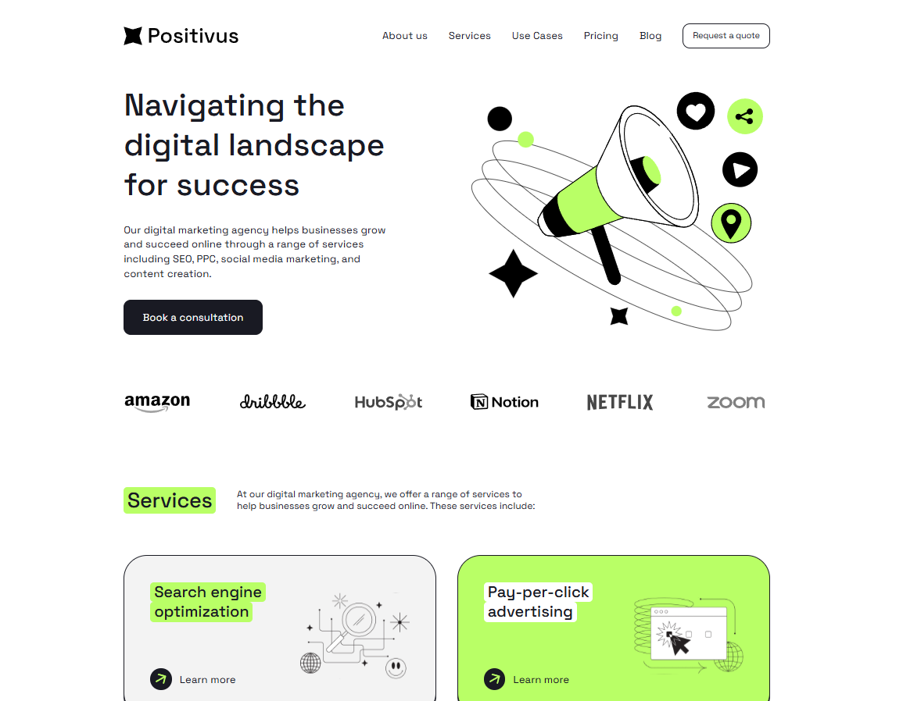

# Positivus

A personal pet project showcasing clean, responsive web design. Built with HTML for semantic structure, SCSS for modular and maintainable styling, and fully adaptive layouts that shine on desktop, tablet, and mobile. Explore a modern UI crafted for positivity and seamless user experience—no frameworks, just pure code elegance.

## Site design preview

## Tech Stack

| Component | Technology |
|-----------|------------|
| Frontend  | Html, SCSS |
